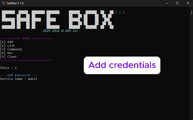

# **  SAFEBOX**

## 🔒 Local Password Manager


SafeBox CLI is a lightweight local password manager built with Python 3.11 for Windows.

The application stores your credentials securely on your computer using encrypted local storage protected by a master password.


---
### 🚀 Get started with SafeBox
🔗 [Documentation, Installation & Demo](https://grdev.tech/app/safebox/doc_FR.html)


## Features

- Secured with a master password
- Encrypted local vault
- Add, edit, search, find, delete credentials
- Portable application
- No cloud storage
- No online account required
- Fully offline

## Demo

<p align="center">
  
</p>


🔗 [Full demo & Documentation](https://grdev.tech/app/safebox/doc_FR.html)

 <!-- <div style="text-align:center;">
<video width="450" height="250" controls autoplay muted loop playsinline >
  <source src="./resources/assets/demo.mp4" type="video/mp4">
</video>
</div>  -->
<!-- [Main Menu](./resources/screen/demo.png) -->

---

# Security
SafeBox uses industry-standard cryptographic algorithms to protect your data:


- **bcrypt** for master password verification
- **PBKDF2-HMAC-SHA256** for encryption key derivation
- **Fernet (AES-128 + HMAC)** for encrypting stored credentials
- **Cryptographically secure random salts** for each password

All credentials are encrypted and stored locally on your device. Your data is never sent to external servers.

## Requirements

- Python 3.11

### Libs
requirements.txt
- bcrypt==5.0.0
- cryptography==48.0.0
- colorama==0.4.6
- Pillow==12.2.0
- pystray==0.19.5

## Installation (V ENV Python)

## 1. Clone or download the project
From Official Repo : [https://github.com/Gwigzz/safebox](https://github.com/Gwigzz/safebox)

## 2. Creat python ENV 
```
> python -m venv venv
```

## 3. Install libs from Virtual Environment
```
> pip install -r requirements.txt
```

---

### 4. Start ENV

```
> env\Scripts\activate 
```

***[!] Restriction window :***
```
> Set-ExecutionPolicy Unrestricted -Scope Process
```
#### Or execut "START_ENV_DEV.bat"

---

### 5 Start app for dev
```
> py safebox.py
```

## Compilation .exe (pyinstaller)
- [!] Need to be compiled in VENV python
```
> pyinstaller --clean safebox.spec
``` 

---
### Tips
- Change py env     > py -3.11 -m venv .venv
- Enabled env py    > deactivate
---

## Informations
- config.local.json
```python
""" Default config.local.json """
data = {
    "password_hash": "",
    "salt": ""
}
```
---
- settings.json
```python

{
    "lang": "...",
    "app_version": "...",
    "release_date": "...",
    "url_website": "...",
    "url_documentation": "..."
}
``` 

## License

SafeBox is released under the MIT License.

See the LICENSE file for more information.